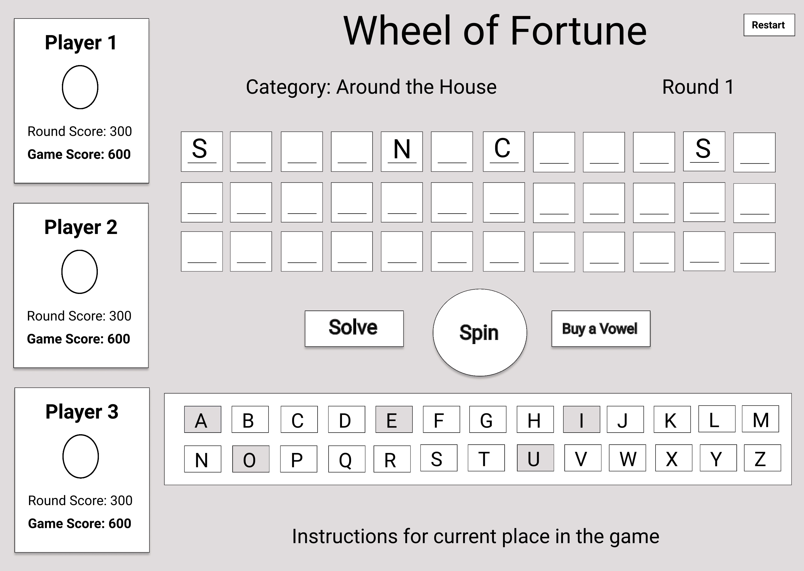

# Wheel of Fortune - Turing Mod 2 Project
Treasure Time is an interactive three-player game where players take turns guessing portions or all of the hidden phrase in an attempt to secure treasure. This game was designed based off of the classic Wheel of Fortune Game. The objective of this project was to implement an application using Object Oriented Programming principles. 

### See It Live
[Treasure Time](https://trbachmann.github.io/wheel-of-fortune/) on GitHub Pages

### Original Assignment
[GameTime](http://frontend.turing.io/projects/wheel-of-fortune.html) project from Turing School of Software and Design 

### Set Up
Clone the repo ```git clone git@github.com:trbachmann/wheel-of-fortune.git```  
Run ```npm install``` from the project root directory

### Testing
Execute tests by running the command ```npm test``` from the project root directory

### Built With
* JavaScript
* jQuery

### Tested With
* Mocha
* Chai

### UI Wireframe
 

### Contributors
[Hillary Stewart](https://github.com/hillstew)  
[Tiffany Bachmann](https://github.com/trbachmann)
