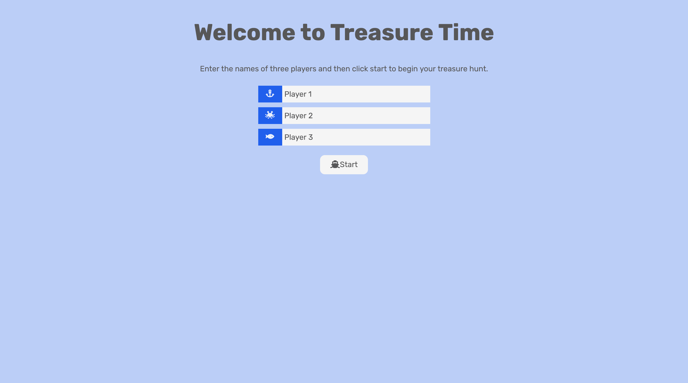
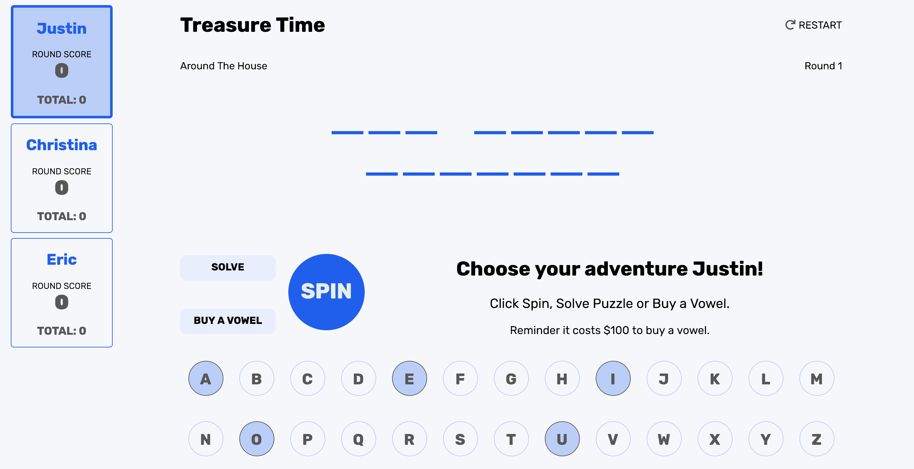

# Wheel of Fortune - Turing Mod 2 Project
Treasure Time is an interactive three-player game where players take turns guessing portions or all of the hidden phrase in an attempt to secure treasure. This game was designed based off of the classic Wheel of Fortune Game. The objective of this project was to implement an application using Object Oriented Programming principles. 

### Set Up
```git clone git@github.com:trbachmann/wheel-of-fortune.git```  
```npm install``` from the project root directory

### See It Live
[Treasure Time](https://trbachmann.github.io/wheel-of-fortune/) on GitHub Pages

### Original Assignment
[GameTime](http://frontend.turing.io/projects/wheel-of-fortune.html) project from Turing School of Software and Design 

### Built With
* JavaScript
* jQuery

### Tested With
* Mocha
* Chai

### UI Wireframe
 

### Screenshots
 
 

### Contributors
[Hillary Stewart](https://github.com/hillstew)  
[Tiffany Bachmann](https://github.com/trbachmann)
